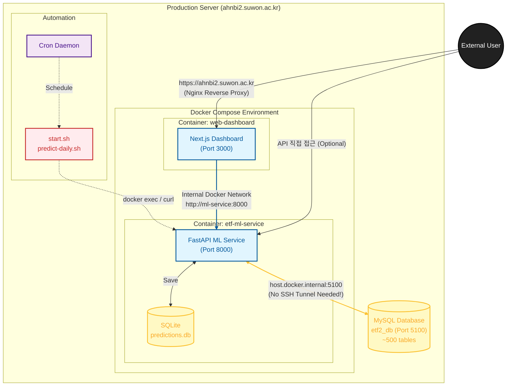

# CLAUDE.md - ETF Trading Pipeline Project

## Project Overview
ETF 주식 데이터 분석 및 예측을 위한 데이터 파이프라인 시스템. FastAPI 기반 ML 서비스가 Docker에서 실행되며, SSH 터널을 통해 원격 MySQL 데이터베이스에 접근합니다. Next.js 기반 웹 대시보드로 예측 결과와 포트폴리오를 시각화합니다.

## (**중요**)

프로젝트에 대한 전반적인 개요는 ai-etf-project skill 을 사용해줘

## 절대 금지 규칙 (NEVER DO)

아래 행동은 어떤 상황에서도 사용자 명시적 승인 없이 절대 수행하지 마라.

### 파일/데이터 삭제 금지
- **프로덕션 데이터 파일 삭제 금지**: `ml-service/data/`, `scraper-service/downloads/`, `logs/`, `*.db` 파일을 절대 삭제하지 마라
- **모델 파일 삭제 금지**: `ml-service/data/models/` 하위의 학습된 모델 파일(`.txt`, `.json`)을 절대 삭제하지 마라
- **쿠키/인증 파일 삭제 금지**: `cookies.json`, `.env`, SSH 키 파일을 절대 삭제하지 마라
- **DB 테이블 DROP 금지**: `DROP TABLE`, `TRUNCATE`, `DELETE FROM` (WHERE 없이) 쿼리를 절대 실행하지 마라

### 서비스 중단 행위 금지
- **프로덕션 Docker 컨테이너 중지 금지**: `docker-compose down`, `docker stop` 을 사용자 확인 없이 실행하지 마라
- **SSH 터널 종료 금지**: `pkill -f "ssh.*3306"` 을 사용자 확인 없이 실행하지 마라
- **cron 작업 삭제 금지**: `crontab -r` 또는 기존 cron 항목 제거를 사용자 확인 없이 하지 마라

### 코드베이스 보호
- **기존 스킬 파일 삭제 금지**: `.claude/skills/` 하위 파일을 삭제하지 마라. 업데이트만 허용
- **CLAUDE.md 전체 덮어쓰기 금지**: 부분 편집(Edit)만 사용하라. Write로 전체 교체하지 마라
- **git force push 금지**: `git push --force`, `git push -f` 를 절대 실행하지 마라
- **main 브랜치 직접 커밋 금지**: 항상 feature 브랜치에서 작업하라

### 외부 시스템 주의
- **원격 서버 직접 명령 금지**: `ssh ahnbi2@... 'rm ...'` 등 원격 서버에서의 파괴적 명령을 실행하지 마라
- **API 키/비밀번호 노출 금지**: 코드, 커밋 메시지, 로그에 인증 정보를 평문으로 포함하지 마라

## 커스텀 검증 및 유지보수 스킬

커스텀 검증 및 유지보수 스킬은 `.claude/skills/`에 정의되어 있습니다.

| Skill | 호출 조건 |
|-------|----------|
| `ai-etf-project` | 프로젝트 목적, 비즈니스 모델, AI ETF 운용 구조, 규제 대응에 대한 질문 시 호출하라 |
| `data-scraping-pipeline` | TradingView 스크래퍼 실행, 데이터 파이프라인, DB 업로드 관련 질문/작업 시 호출하라 |
| `db-ssh-tunneling` | SSH 터널, 원격 MySQL 연결, Docker DB 접근, 연결 오류 디버깅 시 호출하라 |
| `verify-implementation` | 기능 구현 완료 후, PR 전, 코드 리뷰 시 모든 verify 스킬을 통합 실행하라 |
| `manage-skills` | 코드 변경 후 검증 스킬 커버리지 누락 점검, 새 verify 스킬 생성/업데이트 시 호출하라 |
| `verify-ml-service` | ml-service/ 하위 파일 변경 후 구조 일관성 검증 시 실행하라 |
| `verify-scraper-service` | scraper-service/ 하위 파일 변경 후 구조 일관성 검증 시 실행하라 |

## Architecture


## Build & Run Commands

### 전체 서비스 시작
```bash
./start.sh              # SSH 터널 + Docker 서비스 시작 (모든 컨테이너 포함)
```

### 서비스 중지
```bash
./stop.sh               # Docker 서비스 중지 (SSH 터널 유지)
```

### 상태 확인
```bash
./status.sh             # 서비스 상태 및 API 헬스체크
```

### Docker 직접 제어
```bash
docker-compose up -d    # 컨테이너 시작
docker-compose down     # 컨테이너 중지
docker-compose logs -f  # 로그 확인
docker-compose build    # 이미지 재빌드
```

### SSH 터널 수동 시작
```bash
ssh -f -N -L 3306:127.0.0.1:5100 ahnbi2@ahnbi2.suwon.ac.kr
```

### 웹 대시보드 (Docker)
```bash
docker compose up -d web-dashboard    # 웹 대시보드 컨테이너 시작
docker compose logs -f web-dashboard  # 로그 확인
```

### 웹 대시보드 (로컬 개발 - 선택사항)
```bash
cd web-dashboard
npm run dev             # 개발 서버 (http://localhost:3000)
npm run build           # 프로덕션 빌드
npm run start           # 프로덕션 서버
```

## API Endpoints

Base URL: `http://localhost:8000`

| Method | Endpoint | Description |
|--------|----------|-------------|
| GET | `/health` | 헬스체크 |
| GET | `/api/stocks` | 종목 목록 조회 |
| GET | `/api/stocks/{symbol}/history` | 종목 히스토리 조회 |
| POST | `/api/predictions/ranking` | 전체 종목 순위 예측 (주요 엔드포인트) |
| POST | `/api/predictions/batch` | 일괄 예측 (ranking으로 위임) |
| POST | `/api/predictions/{symbol}` | 단일 종목 예측 |
| GET | `/api/predictions` | 저장된 예측 결과 조회 |
| GET | `/api/predictions/ranking/latest` | 최신 랭킹 결과 조회 |

### 예측 API 주의사항
- `/ranking`, `/batch` 엔드포인트가 `/{symbol}` 보다 먼저 선언되어야 함 (경로 충돌 방지)

## Auto-Monitoring Dashboard

Base URL: `http://ahnbi2.suwon.ac.kr/monitor`

실시간 데이터 스크래핑 모니터링 대시보드. 스크래핑 진행 상황, 심볼별 상태, 에러를 실시간으로 확인할 수 있습니다.

### 기능
- 스크래핑 상태 (running/partial/completed/idle)
- 진행률 표시 (완료된 심볼 수 / 전체)
- 심볼별 상태 그리드 (색상으로 상태 표시)
- 통계: 다운로드 수, 업로드 수, 총 행 수
- 에러 목록

### 로그 파일 위치
`scraper-service/tradingview_scraper_upload.log`

## Web Dashboard

Base URL: `http://ahnbi2.suwon.ac.kr` (또는 로컬: `http://localhost:3000`)

### 페이지 구성
| 경로 | 페이지 | 설명 |
|------|--------|------|
| `/` | 대시보드 | 포트폴리오 요약, 예측 시그널, 차트 |
| `/predictions` | 예측 결과 | RSI/MACD 기반 매매 신호 (API 연동) |
| `/portfolio` | 포트폴리오 | 보유 종목, 자산 배분 차트 |
| `/returns` | 수익률 분석 | 누적/일일 수익률, 종목별 기여도 |

### 기술 스택
- Next.js 16 + TypeScript
- shadcn/ui (Vega 스타일)
- Recharts (차트)
- Tailwind CSS

### 주요 파일
```
web-dashboard/
├── app/
│   ├── page.tsx              # 메인 대시보드
│   ├── predictions/page.tsx  # 예측 결과 (API 연동)
│   ├── portfolio/page.tsx    # 포트폴리오
│   └── returns/page.tsx      # 수익률 분석
├── components/
│   ├── app-sidebar.tsx       # 사이드바 네비게이션
│   └── ui/                   # shadcn 컴포넌트
├── lib/
│   ├── api.ts               # FastAPI 연동 함수
│   └── data.ts              # 더미 데이터 (포트폴리오, 수익률)
└── hooks/
    └── use-mobile.tsx       # 반응형 훅
```

## Database Configuration

### Remote MySQL (via SSH Tunnel)
- Host: `host.docker.internal:3306` (Docker 내부에서)
- Database: `etf2_db`
- ~500개 테이블 (AAPL_D, NVDA_1h 등)
- 컬럼: symbol, timeframe, time, open, high, low, close, volume, rsi, macd

### Local SQLite
- 경로: `ml-service/data/predictions.db`
- 용도: 예측 결과 저장

## Cron Automation

### 설정된 작업
1. **매일 오전 8시**: 전체 종목 예측 (`predict-daily.sh`)
2. **매월 1일 새벽 3시**: 모델 학습 (`train-monthly.sh`)

### Cron 설정 방법
```bash
./scripts/setup-cron.sh
```

### 로그 위치
- `logs/cron.log` - cron 실행 요약
- `logs/predict-YYYYMMDD.log` - 일일 예측 상세
- `logs/train-YYYYMM.log` - 월간 학습 상세

## Project Structure
```
etf-trading-project/
├── docker-compose.yml      # Docker 서비스 정의
├── start.sh               # 서비스 시작 스크립트
├── stop.sh                # 서비스 중지 스크립트
├── status.sh              # 상태 확인 스크립트
├── ml-service/
│   ├── Dockerfile
│   ├── requirements.txt
│   ├── data/              # SQLite DB 저장 위치
│   └── app/
│       ├── main.py        # FastAPI 진입점
│       ├── database.py    # DB 연결 설정
│       ├── models/        # SQLAlchemy 모델
│       ├── routers/       # API 라우터
│       └── services/      # 비즈니스 로직
├── web-dashboard/         # Next.js 웹 대시보드
│   ├── app/              # 페이지 컴포넌트
│   ├── components/       # UI 컴포넌트
│   ├── lib/              # API 연동, 데이터
│   └── hooks/            # React 훅
├── auto-monitoring/       # 스크래핑 모니터링 대시보드
│   ├── app/              # Next.js 페이지
│   ├── components/       # UI 컴포넌트
│   └── lib/              # 로그 파서, 타입 정의
├── scraper-service/       # TradingView 데이터 스크래퍼 + FastAPI 서비스
│   ├── tradingview_playwright_scraper_upload.py
│   └── downloads/        # 다운로드된 CSV 파일
├── scripts/
│   ├── predict-daily.sh   # 일일 예측 스크립트
│   ├── train-monthly.sh   # 월간 학습 스크립트
│   └── setup-cron.sh      # cron 설정 스크립트
└── logs/                  # 실행 로그
```

## Key Implementation Notes

### SSH 터널 필수
- 원격 MySQL은 포트 5100에서 실행됨
- Docker 컨테이너는 `host.docker.internal`로 호스트의 터널에 접근

### PATH 설정 (cron 환경)
모든 스크립트 상단에 PATH 설정 필요:
```bash
export PATH="/usr/local/bin:/usr/bin:/bin:/opt/homebrew/bin:$PATH"
export PATH="/Applications/Docker.app/Contents/Resources/bin:$PATH"
```

### 예측 모델 (AhnLab LightGBM LambdaRank)
- LightGBM LambdaRank 기반 전체 종목 상대 순위 랭킹 모델
- 85개 피처 (기술지표 + 거시경제 + 엔지니어링 + Z-score + 랭크)
- 2-fold rolling CV 앙상블 (fold 모델 평균)
- 데이터 소스: etf2_db_processed (피처 전처리 완료된 DB)
- 학습: `ml-service/scripts/train_ahnlab.py`
- 모델 파일: `ml-service/data/models/ahnlab_lgbm/current/`

### 웹 대시보드 API 연동
- `lib/api.ts`에서 FastAPI 엔드포인트 호출
- 예측 결과 페이지: 실시간 API 데이터
- 포트폴리오/수익률: 더미 데이터 (추후 API 확장)

## Troubleshooting

### "docker: command not found" in cron
- 스크립트 상단에 PATH 설정 확인

### "BATCH_D table not found"
- `routers/predictions.py`에서 `/batch` 라우트가 `/{symbol}` 보다 먼저 선언되어 있는지 확인

### MySQL 연결 실패
- SSH 터널이 실행 중인지 확인: `pgrep -f "ssh.*3306"`
- 터널 재시작: `./start.sh`

### 웹 대시보드 API 연결 실패
- FastAPI 서비스 실행 확인: `curl http://localhost:8000/health`
- CORS 설정 확인 (FastAPI에서 localhost:3000 허용 필요)
